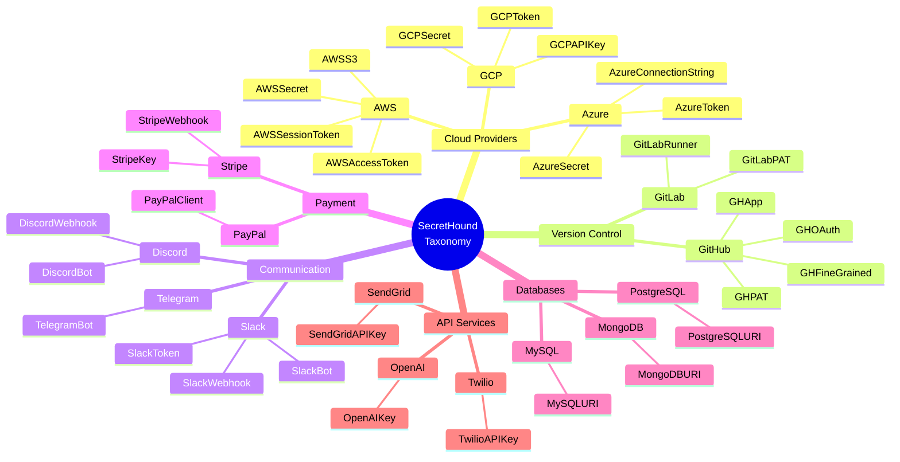

# SecretHound - A BloodHound OpenGraph Extension for Secrets

<p align="center">
  
</p>

SecretHound converts secret scanning results from various sources into BloodHound OpenGraph format for attack path visualization and analysis. Built on @p0dalirius's bhopengraph library.

**Supported Scanners:**
- GitHub Secret Scanning
- NoseyParker
- TruffleHog
- Nemesis (work in progress)

[](https://www.python.org/downloads/)
[](https://bloodhound.specterops.io/)

## Features

- **Centralized Taxonomy System** - 70+ technologies with scanner-specific rule ID mapping
  - Covers 200+ TruffleHog detectors and all NoseyParker rules
  - Choose between comprehensive or minimal taxonomy
  - Sample of technologies supported by the taxonomy system:



- **Dual Node Kind System** - Query secrets by specific type or technology category
  - Example: `AWSSecret` (specific) + `AWSBase` (all AWS secrets)
  - Enables powerful Cypher queries in BloodHound

- **Multi-Scanner Support** - Unified BloodHound format across different tools

## Installation

```bash
git clone https://github.com/C0KERNEL/SecretHound.git
cd SecretHound
python3 -m venv venv
source venv/bin/activate
pip install -r requirements.txt
```

## Quick Start

```bash
# Parse GitHub Secret Scanning output
gh api /orgs/ORG/secret-scanning/alerts > github_alerts.json
python secrethound.py -t github -i github_alerts.json -o secrets.json

# Parse NoseyParker output
noseyparker scan --datastore np.db /path/to/repo
noseyparker report --datastore np.db --format json > noseyparker_output.json
python secrethound.py -t noseyparker -i noseyparker_output.json -o secrets.json

# Parse TruffleHog output
trufflehog git https://github.com/example/repo.git --json > trufflehog_output.jsonl
python secrethound.py -t trufflehog -i trufflehog_output.jsonl -o secrets.json

# Register technology icons in BloodHound (one-time setup)
python custom_icons.py --token YOUR_BLOODHOUND_TOKEN

# Import secrets.json to BloodHound via the UI
```

## Usage

### Command Line Interface

```bash
python secrethound.py -t {github,noseyparker,trufflehog,nemesis} -i INPUT -o OUTPUT [OPTIONS]
```

### Arguments

| Argument | Description |
|----------|-------------|
| `-t, --type` | Scanner type: github, noseyparker, trufflehog, or nemesis (required) |
| `-i, --input` | Input file path (JSON or JSONL) (required) |
| `-o, --output` | Output BloodHound JSON file path (required) |
| `--taxonomy` | Taxonomy configuration file (default: taxonomy.json) |
| `--no-redact` | Include full secrets (DANGEROUS - use with caution! Your nodes in BloodHound will contain the secrets) |
| `--source-kind` | Source kind for BloodHound OpenGraph (default: StargateNetwork) |
| `--nemesis-url` | Nemesis API URL (for nemesis type) |
| `--nemesis-api-key` | Nemesis API key (for nemesis type) |
| `-v, --verbose` | Enable verbose logging |

## Technology Taxonomy System

SecretHound uses a centralized taxonomy system to automatically categorize secrets by technology with colors. The taxonomy maps scanner-specific rule IDs to BloodHound node types.

### Built-in Taxonomy Files

- **taxonomy.json** - Comprehensive taxonomy
  - Covers 200+ TruffleHog detectors
  - All NoseyParker and GitHub Secret Scanning rules mapped
  - Ideal for detailed analysis

- **taxonomy_minimal.json** - Minimal taxonomy highlighting ~25 major technologies
  - Focuses on most common cloud providers and services
  - Cleaner BloodHound graphs with less node kinds

See [TAXONOMY_GUIDE.md](TAXONOMY_GUIDE.md) for complete documentation.

### Using Different Taxonomies

```bash
# Use default comprehensive taxonomy
python secrethound.py -t trufflehog -i input.jsonl -o output.json

# Use minimal taxonomy for cleaner graphs
python secrethound.py -t noseyparker -i input.json -o output.json --taxonomy taxonomy_minimal.json
```

### Dual Node Kind System

Secrets are assigned both specific and base node kinds for flexible querying:

```json
{
  "kinds": ["Secret", "AWSSecret", "AWSBase", "StargateNetwork"],
  "properties": {
    "secret_type": "AWS Secret Access Key",
    "secret_value_redacted": "AKIA...KEY"
  }
}
```

This enables powerful Cypher queries:
- `MATCH (s:StarGate)` - All nodes generated by this tool
- `MATCH (s:Secret)` - All secrets
- `MATCH (s:AWSBase)` - All AWS-related nodes
- `MATCH (s:AWSSecret)` - Only AWS Secrets
- `MATCH (s:GHBase)` - All GitHub nodes
- `MATCH (s:GHSecret)` - All GitHub secrets

### Technology Color Scheme

Each technology uses colors for visualization:

| Technology | Node Kinds | Hex Color |
|------------|-----------|-----------|
| AWS | AWSBase, AWSSecret, AWSAccessToken | `#FF9900` |
| Azure | AZBase, AZSecret, AZToken | `#0078D4` |
| GCP | GCPBase, GCPSecret, GCPToken | `#4285F4` |
| GitHub | GHBase, GHSecret, GHPAT | `#181717` |
| Slack | SlackBase, SlackWebhook, SlackToken | `#4A154B` |
| Stripe | StripeBase, StripeKey | `#635BFF` |
| Default | Secret | `#ffc800` |

See `taxonomy.json` for the complete list technologies.

### Registering Icons in BloodHound

After generating your BloodHound data, register the technology icons:

```bash
# Register icons from comprehensive taxonomy
python custom_icons.py --token YOUR_BLOODHOUND_TOKEN

# Register icons from minimal taxonomy
python custom_icons.py --token YOUR_TOKEN --taxonomy taxonomy_minimal.json

# Use custom BloodHound URL
python custom_icons.py --token YOUR_TOKEN --url http://bloodhound.local:8080/api/v2/custom-nodes
```

## Scanner-Specific Examples

### GitHub Secret Scanning

```bash
# Export alerts from GitHub
gh api /orgs/YOUR_ORG/secret-scanning/alerts > github_alerts.json

# Convert to BloodHound format
python secrethound.py -t github -i github_alerts.json -o bloodhound_secrets.json -v
```

### NoseyParker

```bash
# Scan a repository
noseyparker scan --datastore np.db https://github.com/example/repo.git

# Generate JSON report
noseyparker report --datastore np.db --format json > noseyparker_output.json

# Convert to BloodHound (with redaction - default)
python secrethound.py -t noseyparker -i noseyparker_output.json -o bloodhound_secrets.json
```

### TruffleHog

```bash
# Scan with TruffleHog
trufflehog git https://github.com/example/repo.git --json > trufflehog_output.jsonl

# Convert to BloodHound
python secrethound.py -t trufflehog -i trufflehog_output.jsonl -o bloodhound_secrets.json -v
```

### Nemesis

```bash
# Export data from Nemesis and convert
python secrethound.py -t nemesis -i nemesis_export.json -o bloodhound_secrets.json
```

## Example BloodHound Queries

Take advantage of the dual node kind system:

```cypher
// Find all secrets
MATCH (s:Secret) RETURN s

// Find all AWS-related secrets
MATCH (s:AWSBase) RETURN s

// Find only AWS Secret Access Keys
MATCH (s:AWSSecret) RETURN s

// Find secrets in a specific repository
MATCH p=(r:Stargate)-[:ContainsCredentialsFor]->(s:Secret)
RETURN p

// Count secrets by technology
MATCH (s:Secret)
WITH s, [label IN labels(s) WHERE label ENDS WITH 'Base'] AS tech_labels
UNWIND tech_labels AS tech
RETURN tech, count(s) as count
ORDER BY count DESC
```

## Complete Workflow Example

```bash
# 1. Scan repositories with NoseyParker
noseyparker scan --datastore np.db https://github.com/myorg/myrepo.git
noseyparker report --datastore np.db --format json > noseyparker_output.json

# 2. Convert to BloodHound format
python secrethound.py -t noseyparker -i noseyparker_output.json -o bloodhound_secrets.json -v

# 3. Register technology icons in BloodHound (one-time setup)
python custom_icons.py --token YOUR_BLOODHOUND_TOKEN

# 4. Upload bloodhound_secrets.json to BloodHound CE via web UI

# 5. Query secrets using Cypher in BloodHound interface
```

## Additional Utilities

### Graph Utilities (graph_utils.py)

Modify existing BloodHound graphs programmatically:

```bash
python graph_utils.py
```

Features:
- Import and export BloodHound graphs
- Add/update nodes and edges
- Query nodes by kind or ID
- Get graph statistics
- Merge multiple graphs

### OpenGraph Compatibility

SecretHound is designed to be compatible with existing BloodHound OpenGraph extensions:

**Compatible Extensions:**
- [GitHound](https://github.com/SpecterOps/GitHound) - GitHub repository and user mapping
- [GCP-Hound](https://github.com/F41zK4r1m/GCP-Hound) - GCP technology subgraph

**Planned Integrations:**
- Link secrets to GitHub users, AWS identities, Azure users, and GCP identities
- Commit-level secret tracking
- Repository as starting node

## Acknowledgments

- **SpecterOps** - BloodHound, OpenGraph, GitHound, Nemesis
- **Praetorian** - NoseyParker
- **TruffleSecurity** - TruffleHog
- **LeakTK** - fake-leaks testing repository
- **p0dalirius** - bhopengraph library

## References

- [BloodHound Enterprise](https://specterops.io/bloodhound-enterprise/) / [BloodHound CE](https://github.com/SpecterOps/BloodHound)
- [OpenGraph](https://bloodhound.specterops.io/opengraph/best-practices)
- [GitHound](https://github.com/SpecterOps/GitHound)
- [Nemesis](https://github.com/SpecterOps/Nemesis)
- [NoseyParker](https://github.com/praetorian-inc/noseyparker)
- [TruffleHog](https://github.com/trufflesecurity/trufflehog)
- [LeakTK](https://github.com/leaktk/fake-leaks)
- [bhopengraph](https://github.com/p0dalirius/bhopengraph)
